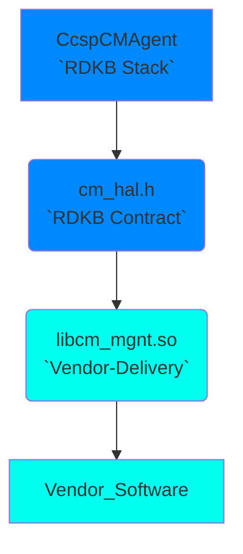
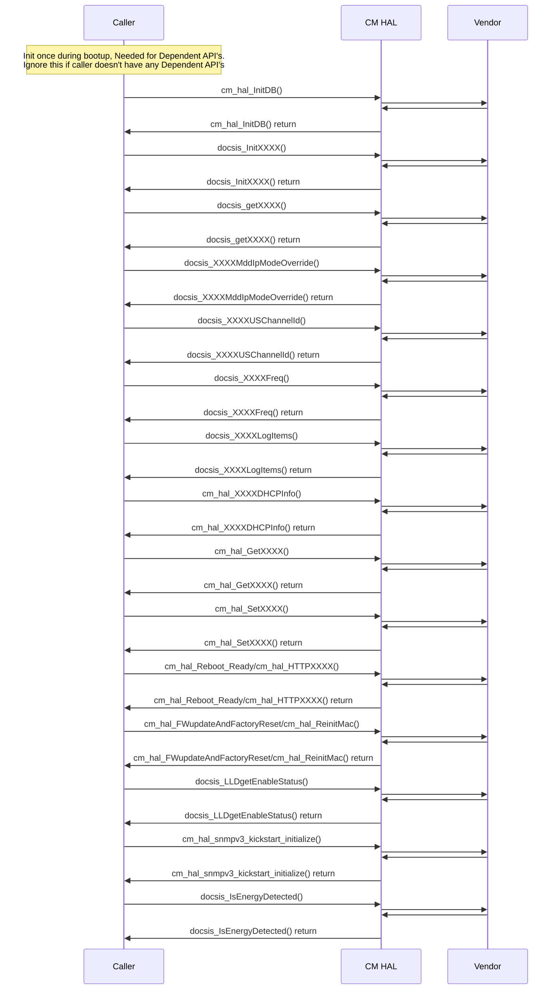

# Broadband CM HAL Documentation

## Acronyms

- `HAL` \- Hardware Abstraction Layer
- `RDK-B` \- Reference Design Kit for Broadband Devices
- `OEM` \- Original Equipment Manufacture
- `CM` \- Cable Modem
- `US` \- Upstream
- `DS` \- Downstream 
- `PLC` \- PHY Link Channel
- `NCP` \-  Network Control Protocol
- `OFDM` \- Orthogonal Frequency Division Multiplexing
- `LKF` \- Low-Level Kernel Filtering

## Description

The diagram below describes a high-level software architecture of the Broadband CM HAL module stack.

Broadband CM HAL is an abstraction layer implemented to abstract the underlying Cable Modem hardware and interact with the underlying vendor software through a standard set of APIs. CM HAL provides interfaces for integrating WAN interfaces with RDK-B. CM related parameters are fetched through CM HAL APIs.

## Component Runtime Execution Requirements

### Initialization and Startup

During initialization and startup, the Broadband CM client module is required to invoke the following APIs in sequence:

- `cm_hal_InitDB()`

This interface is expected to block if the hardware is not ready.

## Threading Model

The interface is not required to be thread safe.

Callers to this API have the responsibility to use it in a thread safe manner.

Vendors have the flexibility to create internal threads and events for tailored operations, but they must assume full accountability for their synchronization, call management, and thorough cleanup upon closure.

## Process Model

This module is expected to be called from multiple process.

The requirement is to ensure that the module can handle concurrent calls effectively. The vendor needs to implement proper synchronization and scalability measures for robust performance.

## Memory Model

### Caller Responsiblities

   1. Callers must assume full responsibility for managing any memory explicitly given to the module functions to populate. This includes proper allocation and de-allocation to prevent memory leaks.

### Module Responsibilities

   1. Modules must independently allocate and de-allocate memory for their internal operations, ensuring efficient resource management.
   
   2. Modules are required to release all internally allocated memory upon closure to prevent resource leaks.
   
   3. All module implementations and caller code must strictly adhere to these memory management requirements for optimal performance and system stability. Unless otherwise stated specifically in the API documentation.
   
TODO: State a footprint requirement. Example: This should not exceed XXXX KB.

## Asynchronous Notification Model

There are no asynchronous notifications.

## Blocking calls

The APIs are expected to work synchronously and should complete within a time period commensurate with the complexity of the operation and in accordance with any relevant Broadband CM specification. Any calls that can fail due to the lack of a response from connected device should have a timeout period in accordance with any API documentation.
The upper layers will call this API from a single thread context, this API should not suspend.

TODO: As we state that they should complete within a time period, we need to state what that time target is, and pull it from the spec if required. Define the timeout requirement.

## Internal Error Handling

All the Broadband CM HAL APIs should return error synchronously as a return argument. While HAL is responsible for managing internal system errors, such as out of memory conditions, it's important to note that the interface level may not always handle recovery from severe system errors effectively. Instead, HAL should prioritize graceful handling of recoverable errors and logging critical issues for further investigation and resolution.

## Persistence Model

There is no requirement for the HAL to persist any setting information. The caller is responsible to persist any settings.

## Nonfunctional requirements

Following non functional requirement should be supported by the component.

## Logging and debugging requirements

The component should log all the error and critical informative messages, preferably using syslog, printf which helps to debug/triage the issues and understand the functional flow of the system.

The logging should be consistent across all HAL components.

If the vendor is going to log then it has to be logged in `cm_vendor_hal.log` file name which can be placed in `/rdklogs/logs/` directory.

Logging should be defined with log levels as per Linux standard logging.
The logging levels specified by the Linux standard logging, in descending order of severity, are FATAL, ERROR, WARNING, NOTICE, INFO, DEBUG, TRACE.

## Memory and performance requirements

The component should not contributing more to memory and CPU utilization while performing normal Broadband CM operations and commensurate with the operation required.

## Quality Control

To maintain software quality, it is recommended that the Firmware Management HAL implementation is verified without any errors using third-party tools such as Coverity, Black Duck, Valgrind, etc.

There should not be any memory leaks/corruption introduced by HAL and underneath 3rd party software implementation.

## Licensing

Broadband CM HAL implementation is expected to released under the Apache License 2.0.

## Build Requirements

The source code should be capable of being built under Linux Yocto environment and should be delivered as a shared library `libcm_mgnt.so`

## Variability Management

The role of adjusting the interface, guided by versioning, rests solely within architecture requirements. Thereafter, vendors are obliged to align their implementation with a designated version of the interface. As per Service Level Agreement (SLA) terms, they may transition to newer versions based on demand needs.

Each API interface will be versioned using [Semantic Versioning 2.0.0](https://semver.org/), the vendor code will comply with a specific version of the interface.

## Platform or Product Customization

None

## Interface API Documentation

All HAL function prototypes and datatype definitions are available in `cm_hal.h` file.
1.  Components/Processes must include `cm_hal.h` to make use of Broadband CM HAL capabilities
2.  Components/Processes must include linker dependency for `libcm_mgnt`.

## Theory of operation and key concepts

Covered as per "Description" sections in the API documentation.

## Sequence Diagram
Here, XXXX refers to multiple functions, please refer header file (cm_hal.h) for more information.

