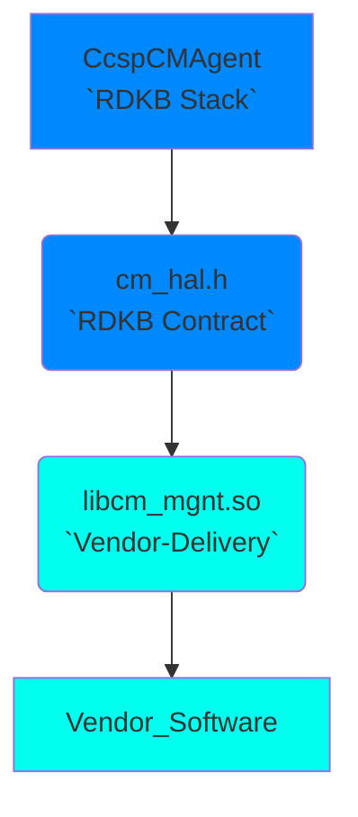
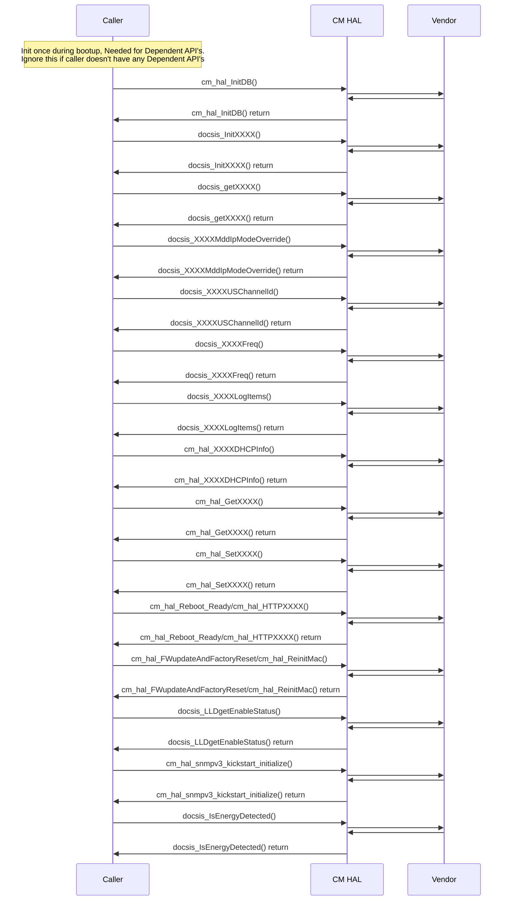

# Broadband CM HAL Documentation

## Acronyms

The following list consolidates acronyms found in the `cm_hal.h` header file and the `CMhalSpec.md` documentation. This comprehensive list encompasses abbreviations specific to cable modem hardware abstraction layers, DOCSIS protocols, network management (including SNMPv3). Understanding these acronyms is crucial for comprehending the technical details and functionality of the RDK-B cable modem ecosystem.

* `ACS`: Auto Configuration Server
* `ANSC`: Adaptive Network Security Configuration
* `BPI`: Baseline Privacy Interface (security protocol for cable modems)
* `CA`: Certificate Authority
* `CBC`: Cipher Block Chaining 
* `CLI`: Command Line Interface
* `CM`: Cable Modem
* `CM HAL`: Cable Modem Hardware Abstraction Layer (simplifies interaction with cable modem hardware and software)
* `CMTS`: Cable Modem Termination System
* `CPE`: Customer Premises Equipment (devices like modems and routers)
* `DHCP`: Dynamic Host Configuration Protocol (assigns network configurations to devices)
* `DOCSIS`: Data Over Cable Service Interface Specification
* `DS`: Downstream (data flow from the provider to the user)
* `DSG`: Downstream Service Group
* `DSOFDM`: Downstream Orthogonal Frequency Division Multiplexing
* `HAL`: Hardware Abstraction Layer
* `HTTP`: Hypertext Transfer Protocol
* `ICCID`: Integrated Circuit Card Identification (unique SIM card identifier)
* `IP`: Internet Protocol
* `IPv4`: Internet Protocol version 4
* `IPv6`: Internet Protocol version 6
* `LKF`: Low-Level Kernel Filtering
* `LLD`: Low Latency DOCSIS
* `LPA`: Local Profile Assistant
* `MAC`: Media Access Control (network protocol for device communication)
* `MDD`: MAC Domain Descriptor
* `MIB`: Management Information Base
* `NCP`: Network Control Protocol 
* `OEM`: Original Equipment Manufacturer
* `OFDM`: Orthogonal Frequency Division Multiplexing
* `OFDMA`: Orthogonal Frequency Division Multiple Access
* `OSA`: Open Systems Architecture
* `PHY`: Physical Layer
* `PLC`: PHY Link Channel
* `QoS`: Quality of Service
* `RDK-B`: Reference Design Kit for Broadband
* `SCDMA`: Synchronous Code Division Multiple Access
* `SNMP`: Simple Network Management Protocol
* `SNR`: Signal-to-Noise Ratio
* `TFTP`: Trivial File Transfer Protocol
* `ToD`: Time of Day
* `TLV`: Type-Length-Value
* `TR-069`: Technical Report 069 (CPE WAN Management Protocol)
* `UCD`: Upstream Channel Descriptor
* `US`: Upstream (data flow from the user to the provider)
* `USG`: Upstream Service Group
* `USOFDMA`: Upstream Orthogonal Frequency Division Multiple Access

## Description

The CM HAL (Cable Modem Hardware Abstraction Layer) module provides a standardized interface for managing and interacting with cable modems within the Reference Design Kit (RDK) environment. It acts as a bridge between higher-level applications and the underlying cable modem hardware, abstracting the complexities of different DOCSIS (Data Over Cable Service Interface Specification) versions and cable modem implementations.

**Key functionalities of the CM HAL include:**

* **Device Management:** Initializing and deinitializing the cable modem, managing its operational status (online/offline), and retrieving device information (e.g., model, firmware version).
* **DOCSIS Operations:** Configuring and managing DOCSIS channels and parameters, retrieving downstream and upstream channel information, and obtaining DOCSIS-related statistics.
* **Network Configuration:** Setting and retrieving network parameters, such as IP addresses, subnet masks, and default gateways for the cable modem.
* **Event Notifications:** Providing notifications to applications about changes in the cable modem's operational status, channel configurations, or other relevant events.
* **Diagnostics:** Offering tools for diagnosing and troubleshooting issues with the cable modem, including retrieving error logs and signal quality information.

By abstracting the complexities of DOCSIS and cable modem hardware, the CM HAL simplifies the development of applications that rely on cable modem connectivity within the RDK ecosystem. It provides a consistent and reliable way to interact with cable modems across different platforms and configurations, facilitating seamless integration of cable modem capabilities into RDK devices.

The diagram below describes a high-level software architecture of the Broadband CM HAL module stack.

## Component Runtime Execution Requirements

### Initialization and Startup

During initialization and startup, the Broadband CM client module is required to invoke the following APIs in sequence:

- `cm_hal_InitDB()`

This interface is expected to block if the hardware is not ready.

## Threading Model

The interface is not required to be thread safe.

Vendors can implement internal threading and event mechanisms for operational purposes. These mechanisms must ensure thread safety when interacting with the provided interface. Additionally, they must guarantee cleanup of resources upon closure.

## Process Model

This module is expected to be called from multiple process.

The requirement is to ensure that the module can handle concurrent calls effectively. The vendor needs to implement proper synchronization and scalability measures for robust performance.

## Memory Model

### Caller Responsiblities

- Callers must assume full responsibility for managing any memory explicitly given to the module functions to populate. This includes proper allocation and de-allocation to prevent memory leaks.

### Module Responsibilities

 - Modules must allocate and de-allocate memory for their internal operations, ensuring efficient resource management.

 - Modules are required to release all internally allocated memory upon closure to prevent resource leaks.

 - All module implementations and caller code must strictly adhere to these memory management requirements for optimal performance and system stability. Unless otherwise stated specifically in the API documentation.

- All strings used in this module must be zero-terminated. This ensures that string functions can accurately determine the length of the string and prevents buffer overflows when manipulating strings.
   
TODO: State a footprint requirement. Example: This should not exceed XXXX KB.

## Asynchronous Notification Model

There are no asynchronous notifications.

## Blocking calls

The APIs are expected to work synchronously and should complete within a time period commensurate with the complexity of the operation and in accordance with any relevant Broadband CM specification. Any calls that can fail due to the lack of a response from connected device should have a timeout period in accordance with any API documentation.
This API is called from a single thread context, therefore it must not suspend.

TODO: As we state that they should complete within a time period, we need to state what that time target is, and pull it from the spec if required. Define the timeout requirement.

## Internal Error Handling

**Synchronous Error Handling:** All Broadband CM HAL APIs must return errors synchronously as a return value. This ensures immediate notification of errors to the caller.

**Internal Error Reporting:** The HAL is responsible for reporting any internal system errors (e.g., out-of-memory conditions) through the return value.

**Focus on Logging for Errors:** For system errors, the HAL should prioritize logging the error details for further investigation and resolution. Recovery attempts at the interface level are not expected to be successful in these cases.

## Persistence Model

There is no requirement for the HAL to persist any setting information.

## Nonfunctional requirements

Following non functional requirement should be supported by the component.

## Logging and debugging requirements

The CM HAL component must record all errors and critical informative messages. This can be achieved by using either the printf or the syslog method. These tools are useful in identifying, and debugging the issues and understanding the functional flow of the system.

The logging should be consistent across all HAL components.

If the vendor is going to log then it has to be logged in `cm_vendor_hal.log` file name which can be placed in `/rdklogs/logs/` directory.

Logging should be defined with log levels as per Linux standard logging.
The logging levels specified by the Linux standard logging, in descending order of severity, are FATAL, ERROR, WARNING, NOTICE, INFO, DEBUG, TRACE.

## Memory and performance requirements

The component should not contributing more to memory and CPU utilization while performing normal Broadband CM operations and commensurate with the operation required.

## Quality Control

To maintain software quality, it is recommended that the CM HAL implementation is verified without any errors using third-party tools such as Coverity, Black Duck, Valgrind, etc.

Both HAL wrapper and 3rd party software implementations should prioritize robust memory management to guarantee leak-free and corruption-resistant operation.

## Licensing

Broadband CM HAL implementation is expected to released under the Apache License 2.0.

## Build Requirements

The source code should be capable of, but not be limited to, building under the Yocto distribution environment. The recipe should deliver a shared library named as libcm_mgnt.so

## Variability Management

The role of adjusting the interface, guided by versioning, rests solely within architecture requirements. Thereafter, vendors are obliged to align their implementation with a designated version of the interface. As per Service Level Agreement (SLA) terms, they may transition to newer versions based on demand needs.

Each API interface will be versioned using [Semantic Versioning 2.0.0](https://semver.org/), the vendor code will comply with a specific version of the interface.

## Platform or Product Customization

None

## Interface API Documentation

All HAL function prototypes and datatype definitions are available in `cm_hal.h` file.
1.  Components/Processes must include `cm_hal.h` to make use of Broadband CM HAL capabilities
2.  Components/Processes must include linker dependency for `libcm_mgnt`.

## Theory of operation and key concepts

Covered as per "Description" sections in the API documentation.

## Sequence Diagram
Here, XXXX refers to multiple functions, please refer header file (cm_hal.h) for more information.

